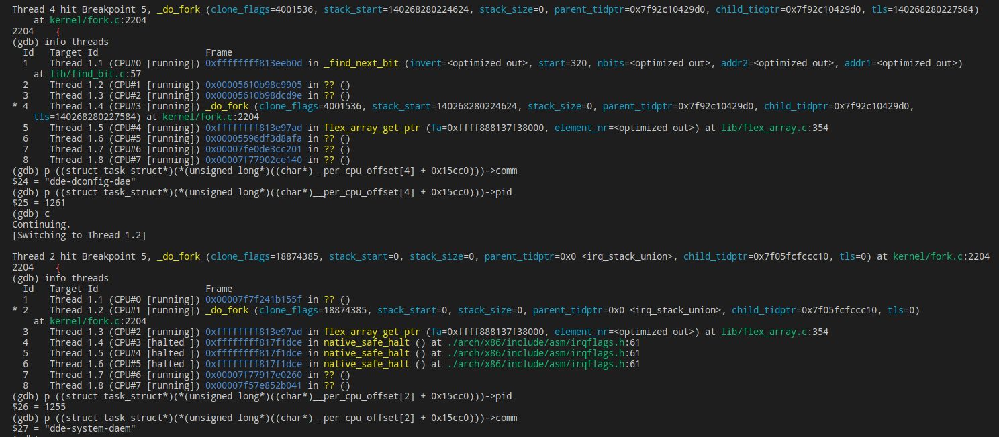

# amd64下基于per_cpu变量current_task获取task_struct

1. 获取current_task地址

    ```bash
    nm vmlinux | grep current_task
    ```

    

2. 获取task_struct指针

    获取当前正在运行的cpu所属线程：

    ```bash
    info threads
    ```

    

    从上图看到有8个cpu，可以改动qemu虚拟化时`-smp 8`参数调整cpu个数。

    ```bash
    (struct task_struct*)(*(unsigned long*)((char*)__per_cpu_offset[4] + 0x15cc0))
    ```

    `__per_cpu_offset[4]`中的下标`4`需要与`info threads`对应上。

    `0x15cc0`为 `nm vmlinux | grep current_task`获取的`current_task`地址。

3. 获取进程号

    ```bash
    p ((struct task_struct*)(*(unsigned long*)((char*)__per_cpu_offset[4] + 0x15cc0)))->pid
    ```

4. 获取进程名

    ```bash
    p ((struct task_struct*)(*(unsigned long*)((char*)__per_cpu_offset[4] + 0x15cc0)))->comm
    ```

    

    如果上述`__per_cpu_offset[4]`下标不对，获取的都是内核0号idle进程。

    

## More

- [一张图看懂linux内核中percpu变量的实现](https://zhuanlan.zhihu.com/p/340985476)
- [linux 进程内核栈](https://zhuanlan.zhihu.com/p/296750228)
- [linux 内核task_struct 源码分析与解析(整合配图）](https://blog.csdn.net/weixin_38371073/article/details/114376410)
- [amd64下基于qemu调试uos-v20-1060-amd64](https://github.com/realwujing/linux-learning/blob/main/kernel/qemu/amd64%E4%B8%8B%E5%9F%BA%E4%BA%8Eqemu%E8%B0%83%E8%AF%95uos-v20-1060-amd64.md)
