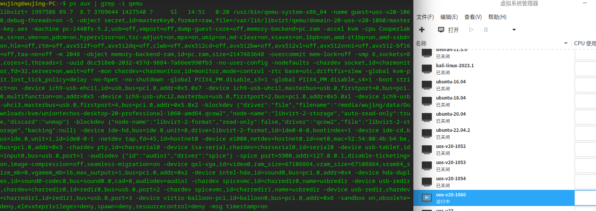

# amd64下基于qemu调试uos-v20-1060-amd64

## 安装环境

```bash
sudo apt-get install qemu qemu-system-arm qemu-efi qemu-efi-aarch64 virtinst virt-manager virt-viewer
```

## 制作启动盘

### 下载镜像

```bash
wget https://cdimage.uniontech.com/daily-iso/1060/professional/daily-stable/20230307/uniontechos-desktop-20-professional-1060-amd64.iso
```

### 安装镜像到虚拟盘



直接利用virt-manager图形界面安装镜像更快。

添加仓库源，仓库源位于:[iso_build_source_professional_amd64.txt](https://cdimage.uniontech.com/daily-iso/1060/professional/daily-stable/20230307/iso_build_source_professional_amd64.txt)

```text
deb http://pools.uniontech.com/desktop-professional eagle main contrib non-free
deb http://pools.uniontech.com/ppa/dde-eagle eagle/1060 main contrib non-free
```

在虚拟机中下载内核调试包，三个deb包版本号要保持一致：

```bash
sudo apt purge linux-headers-$(uname -r) linux-image-$(uname -r) linux-image-$(uname -r)-dbg
sudo apt install linux-headers-$(uname -r)=4.19.90-6004 linux-image-$(uname -r)=4.19.90-6004 linux-image-$(uname -r)-dbg=4.19.90-6004
```

在虚拟机中执行下方命令：

```bash
sudo su
scp /boot/initrd.img-4.19.0-amd64-desktop wujing@10.20.42.43:~/code/qemu/amd64/1060
scp /boot/vmlinuz-4.19.0-amd64-desktop wujing@10.20.42.43:~/code/qemu/amd64/1060
scp /usr/lib/debug/lib/modules/4.19.0-amd64-desktop/vmlinux wujing@10.20.42.43:~/code/qemu/amd64/1060
scp /boot/config-4.19.0-amd64-desktop wujing@10.20.42.43:~/code/qemu/amd64/1060
```

上述操作执行完后关闭此虚拟机。

## 调试虚拟机

在宿主机上执行下方命令:

```bash
sudo qemu-system-x86_64 \
    -accel kvm \
    -cpu host \
    -m 2048 \
    -smp 8 \
    -kernel /home/wujing/code/qemu/amd64/1060/vmlinuz-4.19.0-amd64-desktop \
    -initrd /home/wujing/code/qemu/amd64/1060/initrd.img-4.19.0-amd64-desktop \
    -hda /media/wujing/data/Downloads/kvm/uniontechos-desktop-20-professional-1060-amd64.qcow2 \
    -append "root=/dev/sda5 ro video=efifb:nobgrt splash quiet DEEPIN_GFXMODE= ima_appraise=off security=selinux checkreqprot=1 libahci.ignore_sss=1 nokaslr" \
    -device virtio-scsi-pci,id=scsi0 \
    -device virtio-net-pci,netdev=net0 -netdev user,id=net0,hostfwd=tcp::2222-:22 \
    -device virtio-gpu-pci,id=video0 \
    -device qemu-xhci -device usb-kbd -device usb-tablet \
    -S -s
```

上方 `-append`传递给内核的参数可以通过在启动时，访问 GRUB 启动菜单，按 `e`键编辑引导参数可以看到参数，也可虚拟机启动后通过 `cat /proc/cmdline`查看。

启动时，我们做一下端口转发，我们这里把host的127.0.0.1:2222端口转发到guest的22端口，我们可以使用ssh来连接guest系统。

在宿主机上执行下方命令：

```bash
ssh wujing@127.0.0.1 -p 2222
```

在宿主机上下载1060 4.19.0-amd64-desktop #6004对应内核源码：

```bash
git clone "ssh://ut004487@gerrit.uniontech.com:29418/kernel/x86-kernel" && scp -p -P 29418 ut004487@gerrit.uniontech.com:hooks/commit-msg "x86-kernel/.git/hooks/"
git checkout -b 6004 e61b2ad353ea
```

复制vmlinux到源码目录：

```bash
cp ~/code/qemu/amd64/1060/vmlinux /home/wujing/code/x86-kernel
```

在 `/home/wujing/code/x86-kernel`目录下启动gdb：

```bash
aarch64-linux-gdb vmlinux
target remote :1234
hb start_kernel
c
```

uos-v20-1060内核第一个断点必须设置为硬件断点，否则gdb输出如下Warning且无法捕捉断点：

```text
Warning:
Cannot insert breakpoint 1.
Cannot access memory at address 0xffffffff824bbb8d

Command aborted.
```

敲 `c`命令输出如下：

```text
Thread 1 hit Breakpoint 1, start_kernel () at init/main.c:531
531     {  
```

可以看到断点正常命中，继续敲 `c`命令可以看到虚拟机正常启动到登录界面。

### 修复内核bug

拷贝1060上的`config-4.19.0-amd64-desktop`到`/home/wujing/code/x86-kernel`目录下：

```bash
cp ~/code/qemu/amd64/1060/config-4.19.0-amd64-desktop .config
```

加载config配置：

```bash
make menuconfig
```

选择load → save → exit。

自定义`uname -a` 输出的 `#6004`编译次数：

```bash
echo 6060 > .version
```

方式一：

在宿主机上编译内核：

```bash
make -j16
```

此种方式方式可以加快调试内核bug，此时更改`-kernel /home/wujing/code/qemu/amd64/1060/vmlinuz-4.19.0-amd64-desktop`为`-kernel /home/wujing/code/x86-kernel/arch/x86/boot/bzImage`选项即可，具体命令如下：

```bash
sudo qemu-system-x86_64 \
    -accel kvm \
    -cpu host \
    -m 2048 \
    -smp 8 \
    -kernel /home/wujing/code/x86-kernel/arch/x86/boot/bzImage \
    -initrd /home/wujing/code/qemu/amd64/1060/initrd.img-4.19.0-amd64-desktop \
    -hda /media/wujing/data/Downloads/kvm/uniontechos-desktop-20-professional-1060-amd64.qcow2 \
    -append "root=/dev/sda5 ro video=efifb:nobgrt splash quiet DEEPIN_GFXMODE= ima_appraise=off security=selinux checkreqprot=1 libahci.ignore_sss=1 nokaslr" \
    -device virtio-scsi-pci,id=scsi0 \
    -device virtio-net-pci,netdev=net0 -netdev user,id=net0,hostfwd=tcp::2222-:22 \
    -device virtio-gpu-pci,id=video0 \
    -device qemu-xhci -device usb-kbd -device usb-tablet \
    -S -s
```

如果bug涉及到某个内核驱动模块，上述编译建议在虚拟机上执行，方便以下命令执行。

安装模块：

```bash
sudo make modules_install
```

安装内核:

```bash
sudo make install
```

方式二：

建议通过下方将内核制作成deb包，然后在虚拟机上安装：

注释掉~/code/x86-kernel/scripts/package/Makefile中第83-84行：

```text
deepin-apigail-generate -d=./ -o=./debian/api-tmp.json
deepin-apigail-compare -src=./debian/api.json -dst=./debian/api-tmp.json
```

制作内核deb包：

```bash
make bindeb-pkg -j16
```

## More

- [Running a full system stack under QEMUarm64](https://cdn.kernel.org/pub/linux/kernel/people/will/docs/qemu/qemu-arm64-howto.html)
- [Booting a raw disk image in QEMU](https://unix.stackexchange.com/questions/276480/booting-a-raw-disk-image-in-qemu)
- [使用Qemu在Mac上安装虚拟机](https://blog.csdn.net/weixin_39759247/article/details/126569448)
- [Qemu&amp;KVM 第一篇（2） qemu kvm 相关知识](https://blog.csdn.net/weixin_34253539/article/details/93084893)
- [如何开机进入Linux命令行](https://www.linuxprobe.com/boot-into-linuxcli.html)
