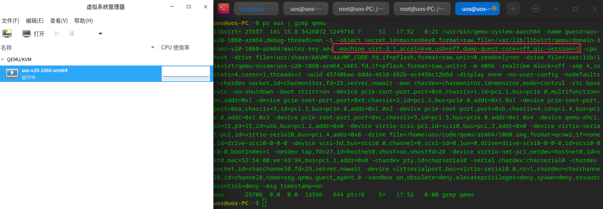

# arm64下基于qemu调式uos-v20-1060-arm64

## 安装环境

```bash
sudo apt-get install qemu qemu-system-arm qemu-efi qemu-efi-aarch64 virtinst virt-manager virt-viewer
```



## 制作启动盘

### 下载镜像

```bash
wget https://cdimage.uniontech.com/daily-iso/1060/professional/daily-stable/20230316-stable/uniontechos-desktop-20-professional-1060-arm64.iso
```

### 创建虚拟盘

```bash
mkdir -p ~/code/qemu/arm64/
cd ~/code/qemu/arm64/
qemu-img create -f qcow2 1060.img 64G
```

### 安装镜像到虚拟盘

```
```

```bash
qemu-system-aarch64 -name guest=uos-v20-1060-arm64,debug-threads=on -machine virt-3.1,accel=kvm,usb=off,dump-guest-core=off,gic-version=3 -cpu host \
      -smp 4 -m 4096 \
      -bios /usr/share/qemu-efi-aarch64/QEMU_EFI.fd \
      -drive if=virtio,format=qcow2,file=/home/uos/code/qemu/arm64/1060.img \
      -device virtio-scsi-pci,id=scsi0 \
      -device virtio-net-pci,netdev=net0 -netdev user,id=net0,hostfwd=tcp::2222-:22 \
      -device scsi-cd,drive=cd  \
      -device virtio-gpu-pci,id=video0  \
      -device qemu-xhci -device usb-kbd -device usb-tablet  \
      -drive if=none,id=cd,format=raw,media=cdrom,readonly,file=/home/uos/Downloads/iso/uniontechos-desktop-20-professional-1060-arm64.iso \
      -net none
```

## 启动虚拟机

```bash
qemu-system-aarch64 -name guest=uos-v20-1060-arm64,debug-threads=on -machine virt-3.1,accel=kvm,usb=off,dump-guest-core=off,gic-version=3 -cpu host \
      -smp 4 -m 4096 \
      -bios /usr/share/qemu-efi-aarch64/QEMU_EFI.fd \
      -drive if=virtio,format=qcow2,file=/home/uos/code/qemu/arm64/1060.img \
      -device virtio-scsi-pci,id=scsi0 \
      -device virtio-net-pci,netdev=net0 -netdev user,id=net0,hostfwd=tcp::2222-:22 \
      -device virtio-gpu-pci,id=video0  \
      -device qemu-xhci -device usb-kbd -device usb-tablet
```

启动时，我们做一下端口转发，我们这里把host的127.0.0.1:2222端口转发到guest的22端口，我们可以使用ssh来连接guest系统。

在宿主机上执行下方命令：

```bash
ssh wujing@127.0.0.1 -p 2222
```

## 调试虚拟机

添加仓库源，仓库源位于:[sources-list-aarch64.txt](https://cdimage.uniontech.com/daily-iso/1060/professional/daily-stable/20230316-stable/report/iso-build-source/sources-list-aarch64.txt)

```text
deb http://pools.uniontech.com/desktop-professional eagle main contrib non-free
deb http://pools.uniontech.com/ppa/dde-eagle eagle/1060 main contrib non-free
```

在虚拟机中下载内核调试包，三个deb包版本号要保持一致：

```bash
sudo apt purge linux-headers-$(uname -r) linux-image-$(uname -r) linux-image-$(uname -r)-dbg
sudo apt install linux-headers-$(uname -r)=4.19.90-6006 linux-image-$(uname -r)=4.19.90-6006 linux-image-$(uname -r)-dbg=4.19.90-6006
```

在虚拟机中执行下方命令：

```bash
sudo su
scp /boot/initrd.img-4.19.0-amd64-desktop wujing@10.20.52.86:~/code/tmp/1060
scp /boot/vmlinuz-4.19.0-amd64-desktop wujing@10.20.52.86:~/code/tmp/1060
scp /usr/lib/debug/lib/modules/4.19.0-amd64-desktop/vmlinux wujing@10.20.52.86:~/code/tmp/1060
```

在宿主机上执行下方命令:

```bash
qemu-system-aarch64 -name guest=uos-v20-1060-arm64,debug-threads=on -machine virt-3.1,accel=kvm,usb=off,dump-guest-core=off,gic-version=3 -cpu host \
      -smp 4 -m 4096 \
      -bios /usr/share/qemu-efi-aarch64/QEMU_EFI.fd \
      -kernel ~/code/x86-kernel/arch/x86/boot/bzImage \
      -initrd ~/code/tmp/1060/initrd.img-4.19.0-amd64-desktop \
      -hda ~/code/tmp/1060/1060.img \
      -append "root=/dev/sda5 ro splash quiet DEEPIN_GFXMODE= ima_appraise=off security=selinux checkreqprot=1 libahci.ignore_sss=1 nokaslr" \
      -net user,hostfwd=tcp::2222-:22 -net nic \
      -S -s
```

上方`-append`传递给内核的参数可以通过在启动时，访问 GRUB 启动菜单，按`e`键编辑引导参数可以看到参数，也可虚拟机启动后通过`cat /proc/cmdline`查看。

在`~/code/tmp/1060`目录下启动gdb：

```bash
aarch64-linux-gdb vmlinux
target remote :1234
hb start_kernel
c
```

uos-v20-1060内核第一个断点必须设置为硬件断点，否则gdb输出如下Warning且无法捕捉断点：

```text
Warning:
Cannot insert breakpoint 1.
Cannot access memory at address 0xffffffff824bbb8d

Command aborted.
```

敲`c`命令输出如下：

```text
Thread 1 hit Breakpoint 1, start_kernel () at init/main.c:531
531     init/main.c: 没有那个文件或目录. 
```

很明显找不到源码，解决方案有两种：

1. `gdb`中使用`dir`命令或`set substitute-path`命令指定和修改搜素源码文件的路径
2. 基于源码编译出内核，在源码目录执行`aarch64-linux-gdb vmlinux`命令。

下文采用方案2：

下载1060-2源码：

```bash
git clone "ssh://ut004487@gerrit.uniontech.com:29418/kernel/arm-kernel" && scp -p -P 29418 ut004487@gerrit.uniontech.com:hooks/commit-msg "arm-kernel/.git/hooks/"
git checkout -b develop/need_merge need_merge
```

内核编译选项配置参考：[内核编译选项配置](https://github.com/realwujing/linux-learning/blob/main/debug/kernel/qemu/%E5%9F%BA%E4%BA%8Eqemu%20tap(NAT%E7%BD%91%E7%BB%9C)%E3%80%81debootstrap%20%E8%B0%83%E8%AF%95%E5%86%85%E6%A0%B8%E3%80%81%E6%A0%B9%E6%96%87%E4%BB%B6%E7%B3%BB%E7%BB%9F.md#%E5%86%85%E6%A0%B8%E7%BC%96%E8%AF%91%E9%80%89%E9%A1%B9%E9%85%8D%E7%BD%AE)

内核编译完成后启动虚拟机：

```bash
qemu-system-x86_64 \
-smp 2 \
-enable-kvm \
-cpu host \
-m 2G \
-kernel ~/code/x86-kernel/arch/x86/boot/bzImage \
-initrd ~/code/tmp/1060/initrd.img-4.19.0-amd64-desktop \
-hda ~/code/tmp/1060/1060.img \
-append "root=/dev/sda5 ro splash quiet DEEPIN_GFXMODE= ima_appraise=off security=selinux checkreqprot=1 libahci.ignore_sss=1 nokaslr" \
-net user,hostfwd=tcp::2222-:22 -net nic \
-S -s
```

在`~/code/x86-kernel`目录下启动gdb：

```bash
aarch64-linux-gdb vmlinux
target remote :1234
hb start_kernel
c
```

敲`c`命令输出如下：

```text
Thread 1 hit Breakpoint 1, start_kernel () at init/main.c:531
531     {  
```

可以看到断点正常命中，继续敲`c`命令可以看到虚拟机正常启动到登录界面。

## More

- [Running a full system stack under QEMUarm64](https://cdn.kernel.org/pub/linux/kernel/people/will/docs/qemu/qemu-arm64-howto.html)
- [Booting a raw disk image in QEMU](https://unix.stackexchange.com/questions/276480/booting-a-raw-disk-image-in-qemu)
- [使用Qemu在Mac上安装虚拟机](https://blog.csdn.net/weixin_39759247/article/details/126569448)
- [Qemu&KVM 第一篇（2） qemu kvm 相关知识](https://blog.csdn.net/weixin_34253539/article/details/93084893)
- [如何开机进入Linux命令行](https://www.linuxprobe.com/boot-into-linuxcli.html)
